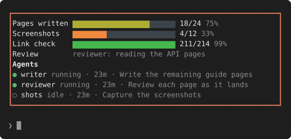
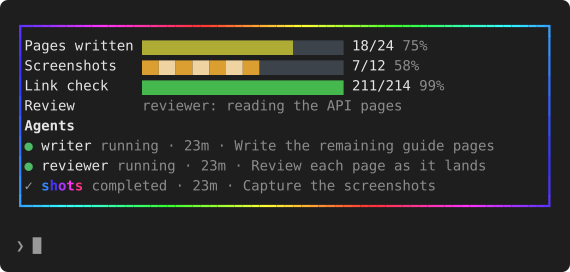

# progress-band

A live progress band above the Claude Code prompt: a bar for every step of the work Claude is doing, and
the status of every agent and teammate it has running.



When anything changes, a rainbow runs round the frame for 15 seconds: the bar that moved shows a sliding
barber pole, and an agent that started, went idle or finished shows its name in a moving rainbow. Between
changes nothing animates, so an idle band costs nothing.



The plugin teaches Claude to keep the band current, so there is nothing to set up per project: when
Claude starts multi-step work, a batch job or a team of agents, it writes a small progress file and
updates it as steps finish.

---

## Install

### macOS / Linux

```sh
curl -fsSL https://raw.githubusercontent.com/anthonybo/progress-band/main/install.sh | sh
```

### Windows

```powershell
irm https://raw.githubusercontent.com/anthonybo/progress-band/main/install.ps1 | iex
```

Either one adds this repo as a plugin marketplace, installs the plugin for your user (every project, every
session), and creates the progress folder. Run it again any time to update.

New sessions show the band. In a session that is already open, run `/reload-plugins`.

<details>
<summary>Installing by hand instead</summary>

Inside Claude Code:

```
/plugin marketplace add anthonybo/progress-band
/plugin install progress-band@progress-band
```

Or from a shell: `claude plugin marketplace add anthonybo/progress-band` then
`claude plugin install progress-band@progress-band`.

</details>

Built and tested on Claude Code 2.1.295; it needs a version whose plugins can draw above the prompt.

## In cmux

progress-band was built in [cmux](https://github.com/manaflow-ai/cmux), and it is made for it:

- **Install once, every pane gets it.** The plugin is installed for your user, so each Claude pane loads it.
  Panes that were already open need `/reload-plugins` once (or close and reopen them).
- **Only the lead pane draws the band.** Agent-team teammates that cmux opens in their own panes are
  detected (they inherit `CLAUDECODE` from the lead) and draw nothing, so a screen of teammate panes does
  not repeat the band in every one. The lead's band lists every teammate with its status.
- **Teammates still report.** The instructions reach teammates too, so their progress files show on the
  lead's band.
- **Fits narrow panes.** The band is one row per bar and no padding; it fits a pane from 34 columns, and
  bars shrink before labels do.

## Using it

- `/progress` hides or shows the band.
- A bar at 100% stays two minutes so its completion is seen, then leaves. It returns if its count
  changes. That clock is kept between sessions, so reopening a session does not bring finished work back.
- A row without a total (a `note`) never ages out. Delete it, or its file, when the job is done; Claude
  does this itself when it finishes.

### Progress files

Claude writes these itself, but anything can: a script, a build, you. One JSON file per project or job in
`~/.claude/progress/` (`$CLAUDE_CONFIG_DIR/progress/` if you set that; `%USERPROFILE%\.claude\progress\`
on Windows). The band groups rows by `title` (the file name when absent):

```json
{
  "title": "Docs site",
  "items": [
    { "label": "Pages written", "done": 18, "total": 24 },
    { "label": "Species", "total": 200, "countLines": "/abs/path/species.jsonl" },
    { "label": "Review", "note": "reviewer: reading the API pages" }
  ]
}
```

| Row | Draws |
| --- | --- |
| `done` + `total` | A bar; whoever does the work updates `done`. |
| `total` + `countLines` | A bar whose count is the non-empty lines of that file, or of a list of files summed (absolute paths; a missing file counts 0). The count is measured, never typed. |
| `note` alone | A status line with no bar, for work with no honest percentage. |

Bars run red, orange, gold, then green as they fill. The band re-reads the folder every 5 seconds and
redraws only when something changed.

## How Claude learns to use it

The plugin adds one short section to the end of Claude's system prompt: where the progress folder is, the
file format above, and when to write one (multi-step work, batch jobs, agent teams; not quick one-step
tasks). It asks Claude to count the whole pipeline (review, tests and install as steps, not just the
building), so a bar never sits at "done" while work goes on. The section's text is fixed per machine, so
it does not disturb prompt caching. The exact text is `instructions` in
[`hooks/register.tsx`](hooks/register.tsx).

## Uninstall

```sh
claude plugin uninstall progress-band@progress-band
claude plugin marketplace remove progress-band
```

Progress files in `~/.claude/progress/` are left alone; delete the folder if you want them gone.

## Development

```sh
git clone https://github.com/anthonybo/progress-band
cd progress-band
claude plugin validate .     # manifest, hooks and the state they use
claude plugin test .         # tests/*.test.ts
sh tools/make-docs-images.sh # regenerate docs/*.svg
```

The README images are drawn by the band's own render code from made-up sample data
([`tests/render.test.ts`](tests/render.test.ts)) and turned into SVG by
[`tools/tree-to-svg.py`](tools/tree-to-svg.py), so they cannot drift from what the plugin draws.

To try changes, load the folder directly: `claude --plugin-dir .`

## License

MIT
